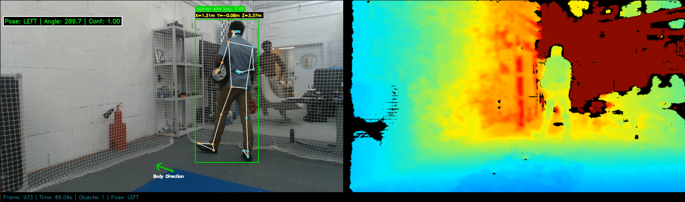

# Drone Human-Object Detection (ROS2)

A ROS2 package for real-time detection and 3D localization of humans and objects using a drone-mounted RealSense camera with GroundingDINO zero-shot object detection.



## Features

- **Zero-shot Object Detection**: Uses GroundingDINO for text-prompted object detection - no training required
- **3D Position Estimation**: Combines RGB detection with RealSense depth for accurate 3D localization
- **Dual Camera Support**: Configurable for downward-facing (objects) and front-facing (humans) cameras
- **ROS2 Integration**: Full ROS2 Humble support with custom messages, launch files, and configurable parameters
- **Real-time Performance**: Optimized for drone applications with GPU acceleration

## System Architecture

```
┌─────────────────┐     ┌──────────────────────────┐     ┌───────────────────┐
│  RealSense D435 │────▶│  Detection Node          │────▶│/object_position   |
│  (RGB + Depth)  │     │  - GroundingDINO         │     │/human_position    |
└─────────────────┘     │  - Depth Fusion          │     │/detection_markers |
                        │  - 3D Localization       │     │/detection_image   |
                        └──────────────────────────┘     └───────────────────┘
```

## Requirements

### Hardware
- Intel RealSense D435/D435i camera
- NVIDIA GPU (GTX 1060+ recommended)
- Drone platform (tested with PX4/MAVROS)

### Software
- Ubuntu 22.04
- ROS2 Humble
- Python 3.10+
- CUDA 11.x / 12.x
- PyTorch 2.0+

## Installation

### 1. Clone the repository
```bash
cd ~/ros2_ws/src
git clone https://github.com/monijesuj/drone-human-object-detection.git
```

### 2. Install GroundingDINO
```bash
cd ~/
git clone https://github.com/IDEA-Research/GroundingDINO.git
cd GroundingDINO
pip install -e .

# Download weights
mkdir weights && cd weights
wget https://github.com/IDEA-Research/GroundingDINO/releases/download/v0.1.0-alpha/groundingdino_swint_ogc.pth
```

### 3. Install Python dependencies
```bash
pip install torch torchvision opencv-python numpy pyrealsense2
```

### 4. Build the ROS2 package
```bash
cd ~/ros2_ws
colcon build --packages-select detection_and_distance
source install/setup.bash
```

## Usage

### Launch the detection node
```bash
ros2 launch detection_and_distance detection.launch.py
```

### With custom prompts
```bash
ros2 launch detection_and_distance detection.launch.py \
    object_prompt:="orange box" \
    human_prompt:="person wearing black"
```

### Parameters

| Parameter | Default | Description |
|-----------|---------|-------------|
| `object_prompt` | `"Grey LiPo battery"` | Text prompt for object detection |
| `human_prompt` | `"human"` | Text prompt for human detection |
| `box_threshold` | `0.30` | Detection confidence threshold |
| `text_threshold` | `0.20` | Text matching threshold |
| `drone_frame` | `"drone"` | TF frame for published poses |

## Topics

### Subscribed Topics
| Topic | Type | Description |
|-------|------|-------------|
| `/camera/camera_down/color/image_raw` | `sensor_msgs/Image` | RGB image from downward camera |
| `/camera/camera_down/depth/image_rect_raw` | `sensor_msgs/Image` | Depth image from downward camera |
| `/camera/camera_down/color/camera_info` | `sensor_msgs/CameraInfo` | Camera intrinsics |

### Published Topics
| Topic | Type | Description |
|-------|------|-------------|
| `/object_position` | `geometry_msgs/PoseStamped` | 3D position of detected object |
| `/human_position` | `geometry_msgs/PoseStamped` | 3D position of detected human |
| `/detection_markers` | `visualization_msgs/MarkerArray` | RViz visualization markers |
| `/detection_image` | `sensor_msgs/Image` | Annotated RGB image |

## Custom Messages

### HumanPose.msg
```
std_msgs/Header header
detection_and_distance/Landmark[] landmarks
string orientation_label
float32 orientation_angle
float32 orientation_confidence
float32 detection_confidence
```

### Landmark.msg
```
float32 x
float32 y
float32 z
float32 visibility
```

## Configuration

Edit `config/detection_params.yaml` to customize default parameters:

```yaml
detection_and_distance_node:
  ros__parameters:
    object_prompt: "Grey LiPo battery"
    human_prompt: "human"
    box_threshold: 0.30
    text_threshold: 0.20
    drone_frame: "drone"
```

## Integration with Drone Navigation

This package is designed to work with drone navigation systems. The published `/object_position` and `/human_position` topics can be used by navigation planners to:

- Navigate towards detected objects
- Maintain safe distance from humans
- Track moving targets

Example integration with PX4/MAVROS available in the `examples/` folder.
<!-- 
## Citation

If you use this work in your research, please cite: -->

<!-- ```bibtex
@software{drone_human_object_detection,
  title = {Drone Human-Object Detection},
  author = {James},
  year = {2025},
  url = {https://github.com/monijesuj/drone-human-object-detection}
}
``` -->

## License

MIT License - see [LICENSE](LICENSE) for details.

## Acknowledgments

- [GroundingDINO](https://github.com/IDEA-Research/GroundingDINO) - Zero-shot object detection
<!-- - [Intel RealSense](https://www.intelrealsense.com/) - Depth camera SDK
- [ROS2](https://docs.ros.org/en/humble/) - Robot Operating System -->
